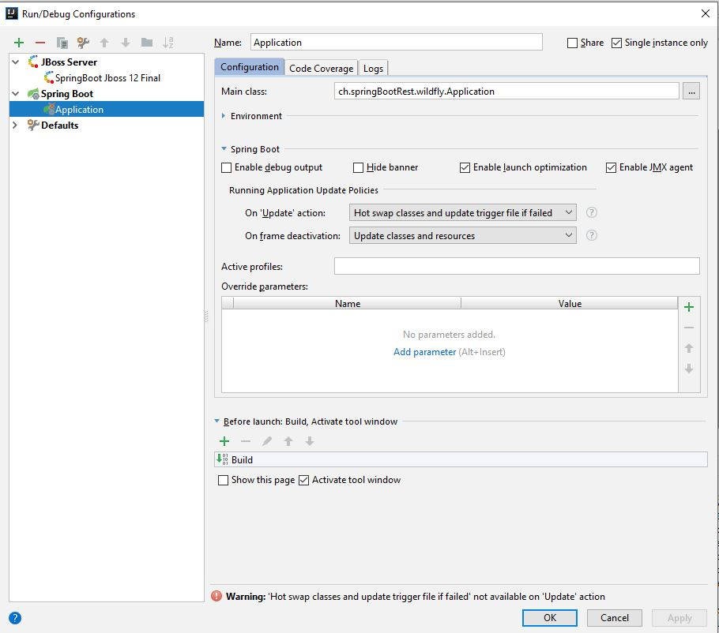
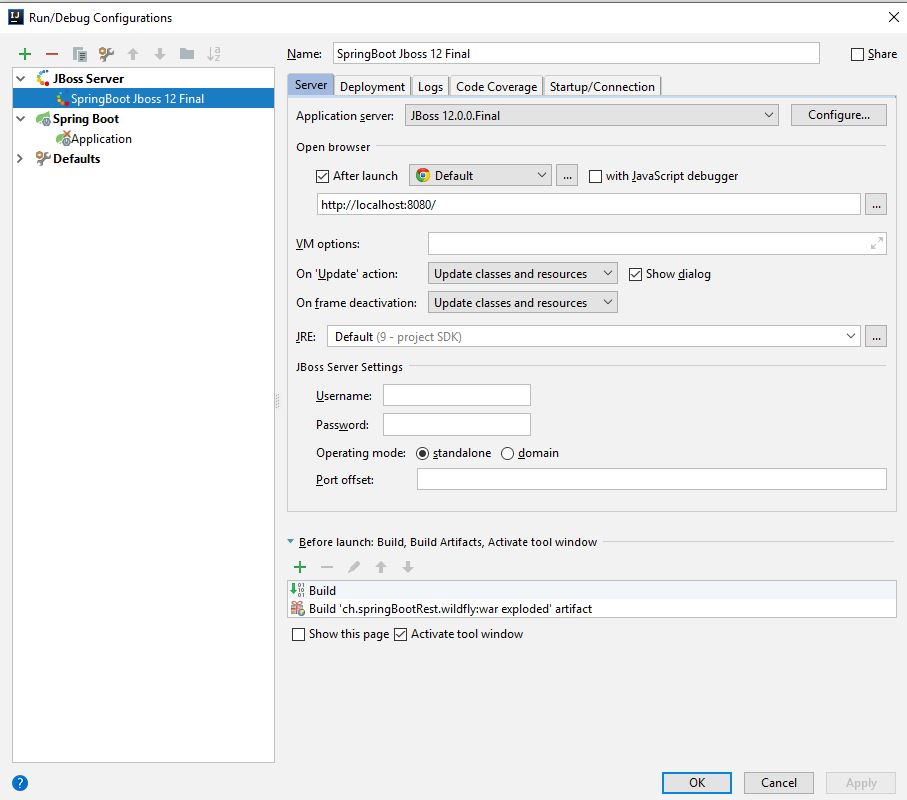

#Spring Boot with WildFly (JBoss)

This is a basic EE setup to run SpringBoot without WildFly or with WildFly /JBoss.
In this kata an attempt was made to develop a varinate, where from the legacy world into 
the new world can be transferred.

> legacy applications JBoss/Jsf === Microservice Cloud / Reactjs)


##API Rest Endpoints:
```
http://localhost:8080/api/v1/personinfo
http://localhost:8080/api/v1/personinfo/{personName}
http://localhost:8080/api/v1/personinfo/current-person-state
http://localhost:8080/api/v1/personinfo/person-states
http://localhost:8080/api/v1/personinfo/is-state-count-valid
```

## Run with Springboot
> java -jar target/ch.springBootRest.wildfly-1.0.1-SNAPSHOT.war

## Run with WildFly
copy the war file to your EE server
> cp target/ch.springBootRest.wildfly-1.0.1-SNAPSHOT.war {pathWildFlyServerInstall}/standalone/deployments

run your server
> cd {pathWildFlyServerInstall}/bin
>  ./standalone.sh

## Ide run/debug configurations

>SpringBoot



>WildFly


